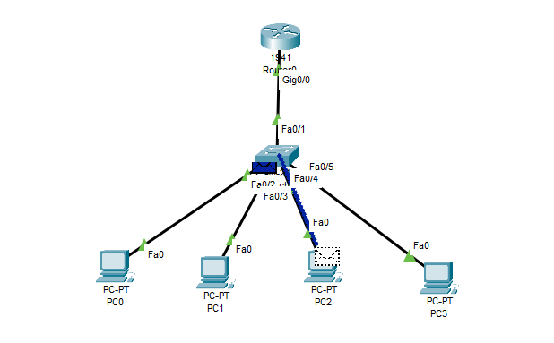

# LAN Scenario 05 – DHCP Configuration Using a Cisco Router

## 🎯 Objective
Set up a basic LAN where a Cisco router acts as a **DHCP server** that automatically assigns IP addresses to connected PCs.

---

## 🧱 Devices Used
- 1× Router (Cisco 2911 or similar)
- 1× Switch
- 3× PCs
- Copper Straight-through cables

---

## 🧠 Network Topology

The router is configured to assign IPs using DHCP.  
Each PC gets its configuration automatically.


🖼️ Network Diagram:  


---

## 🌐 IP Addressing Plan

| Device   | Interface   | IP Address      | Notes                      |
|----------|-------------|------------------|-----------------------------|
| Router   | G0/0        | 192.168.10.1     | DHCP Default Gateway        |
| PC0      | —           | DHCP             | Receives IP from router     |
| PC1      | —           | DHCP             | Receives IP from router     |
| PC2      | —           | DHCP             | Receives IP from router     |

- **Network:** 192.168.10.0/24  
- **Default Gateway:** 192.168.10.1  
- **Excluded IPs:** 192.168.10.1 – 192.168.10.9  
- **DHCP Pool Range:** 192.168.10.10 – 192.168.10.254  
- **DNS Server:** 8.8.8.8

---

## ⚙️ Router Configuration (DHCP Setup)

```bash
enable
configure terminal

interface gig0/0
 ip address 192.168.10.1 255.255.255.0
 no shutdown
exit

ip dhcp excluded-address 192.168.10.1 192.168.10.9

ip dhcp pool LAN_POOL
 network 192.168.10.0 255.255.255.0
 default-router 192.168.10.1
 dns-server 8.8.8.8
